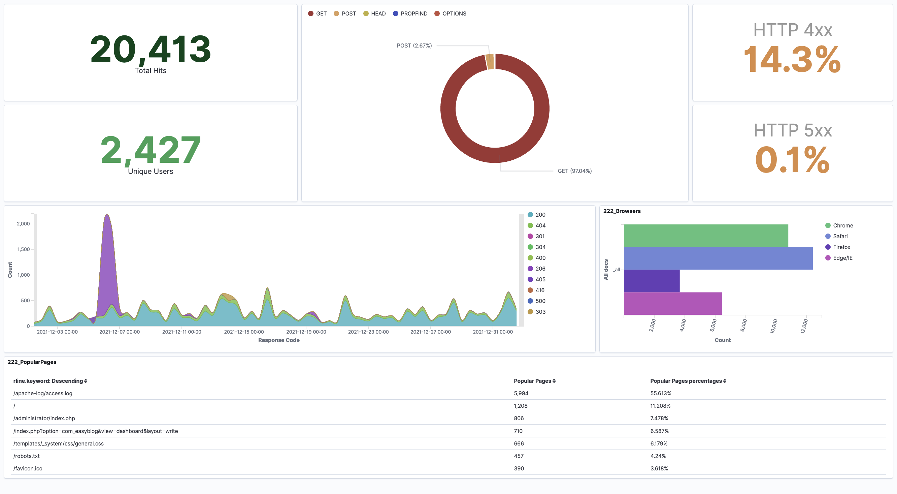
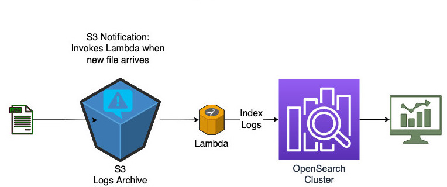

## Objective
This is a demo project to build a dashboard for business to analyse usage of their website using an event driven architecture. Under the hood, it uses AWS OpenSearch service, S3 and Lambda. Project utilizes terraform and Makefile easy maintainance and deployment.

### How it works

Whenever a new file arrives at the s3 bucket, a lambda function is triggered which index the new logs into the target OpenSearch cluster. This way the dashboard is updated in near real time. 

Following is a sample screenshot of the dashboard.
<br>

<kbd></kbd>

<br>

>We are assuming the web servers fleet has a mechanism to regularly push logs to an S3 log bucket. This article does not cover that part. However there are sample AWS CLI commands to mimic this behavior.

<br>

### Design




### Dataset

For testing, we are using a [public dataset](http://www.almhuette-raith.at/apache-log/access.log) which has about 3million Apache web access logs entries. Samples from this dataset are stored under ./sample_data directory.


### Notes:

>This is for demo only. For production use-cases, more strict security settings are required.


* To keep it simple, no VPC is used.
* Kibana Dashboard and ElasticSearch endpoint will be accessible from a single IP address only. This is the public IP from which the project is deployed.
* At the time of this work, the latest Terraform AWS provider version was 4.8. The AWS change from ElasticSearch to OpenSearch is not updated on it. Hence the code is using ElasticSearch 7.10 which is the last version of ElasticSearch AWS supports. This change is in the pipeline for terraform. Ref: [Terraform ticket](https://github.com/hashicorp/terraform-provider-aws/issues/21787)
* Project is relying on the UNIX make command to facilitate CI/CD. Run the "make help" command for more details.
* Dashboard is generated from an existing file: kibana_dashboard_export.ndjson
<br>

### Development Setup

If not already there, install Python3, Terraform, pipenv and AWS CLI. You would need to configure AWS CLI credentials prior to running the "make deploy" command.

```
# Install pipenv
pip install pipenv

# Install & Configure AWS CLI
pip install awscli
aws configure
```

Checkout project
```
git clone https://github.com/contino/web-usage-dashboard.git
cd web-usage-dashboard
```

Configure Python virtual environment and download dependencies:

```
make init
```

### Test
You can run Python unit tests for Lambda code as follows.
```
make test
```

### Build
This will package the lambda code along with its dependencies into a deployable zip file.
```
make build
```
### Deploy 
This will deploy the terraform code into AWS cloud.
```
make deploy PROJECT_NAME=<project name>
```
Under the hood, it constructs and executes the "terraform apply" command. On successful completion, this will create the required cloud resources and generate an output as follows. 
```
Kibana Dashboard: "https://<domain name>.eu-west-2.es.amazonaws.com/_plugin/kibana/app/dashboards"

Upload a sample log file to test by using the following command:
aws s3 cp ./sample_data/2021-12.log  s3://manitest6-20220414145147066300000001/
```

### Demo
The application can be tested  by manually adding log files into S3. There is no data in the cluster immediately after it is created. To demo, follow the steps below.```
```
# Step-1: Deploy the infrastructure. This may take a few mins.
make deploy PROJECT_NAME=<project name>

# Step-2: Open Kibana URL in your preferred browser. 
#         Dashboard is empty at this stage as there is no data indexed yet.

# Step-3: Add logs to bucket
aws s3 cp ./sample_data/2021-12.log  s3://<bucket name>/ 

# Step-4: Go back to the dashboard and refresh. It should have data for the period 2021-12 now.
```
## How to destroy 
```
make destroy PROJECT_NAME=<project name>
```


